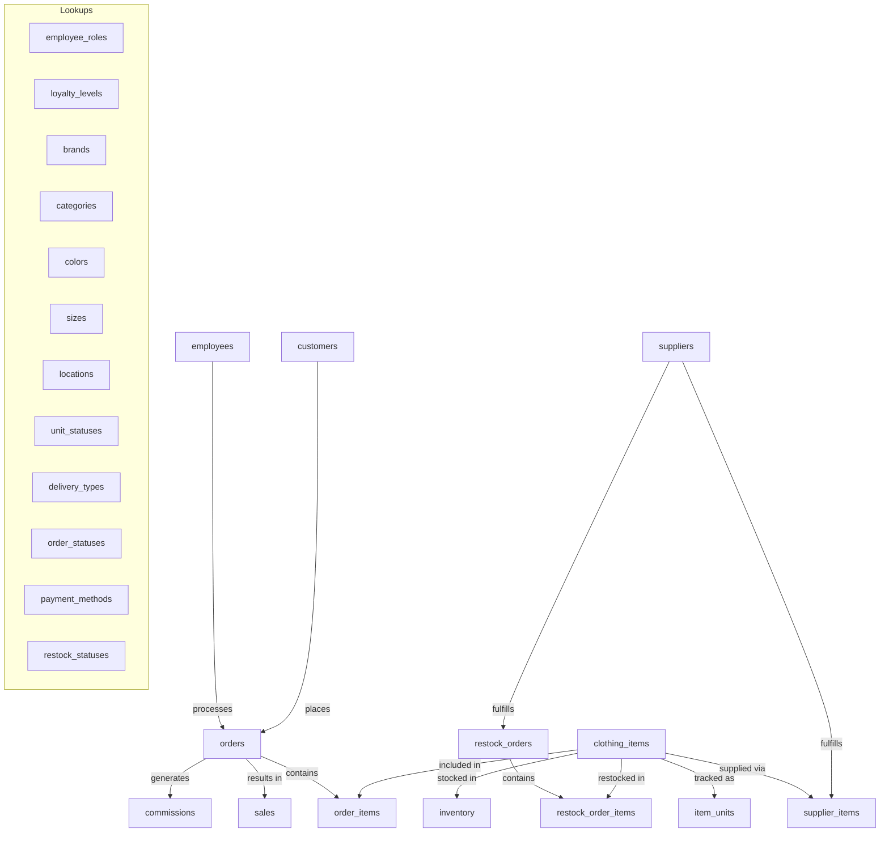

# Clothing Store Database — SQL Migrations

A fully-relational clothing store management database built for **PostgreSQL**.  
It tracks employees, customers, clothing inventory, RFID-tagged units, sales transactions, and supplier restocking.

---

## Run Order

| File | Purpose |
|------|---------|
| [`001_init.sql`](001_init.sql) | Create all tables, constraints, and indexes |
| [`002_seed_data.sql`](002_seed_data.sql) | Insert sample/seed data |
| [`003_views.sql`](003_views.sql) | Create reporting and dashboard views |
| [`004_queries_example.sql`](004_queries_example.sql) | Example SELECT / UPDATE / DELETE queries |

> Additional deep-dives are in [`docs/`](docs/).

---

## Entity-Relationship Diagram

```mermaid
erDiagram
    EMPLOYEES {
        int employee_id PK
        varchar first_name
        varchar last_name
        varchar ssn
        int role_id FK
        varchar access_token
        decimal hourly_rate
    }

    EMPLOYEE_ROLES {
        int role_id PK
        varchar role_name
    }

    CUSTOMERS {
        int customer_id PK
        varchar first_name
        varchar last_name
        varchar phone_number
        int loyalty_id FK
    }

    LOYALTY_LEVELS {
        int loyalty_id PK
        varchar loyalty_name
    }

    CLOTHING_ITEMS {
        int item_id PK
        varchar item_name
        int brand_id FK
        int category_id FK
        int color_id FK
        int size_id FK
        decimal price
    }

    BRANDS {
        int brand_id PK
        varchar brand_name
    }

    CATEGORIES {
        int category_id PK
        varchar category_name
    }

    COLORS {
        int color_id PK
        varchar color_name
    }

    SIZES {
        int size_id PK
        varchar size_name
    }

    ITEM_UNITS {
        varchar rfid PK
        int item_id FK
        int location_id FK
        int unit_status_id FK
    }

    LOCATIONS {
        int location_id PK
        varchar location_name
    }

    UNIT_STATUSES {
        int unit_status_id PK
        varchar status_name
    }

    INVENTORY {
        int item_id PK
        int quantity_available
        int reorder_level
        int future_shipment_quantity
    }

    ORDERS {
        int order_id PK
        int customer_id FK
        int employee_id FK
        timestamp order_date
        int delivery_type_id FK
        int order_status_id FK
    }

    ORDER_ITEMS {
        int order_item_id PK
        int order_id FK
        int item_id FK
        int quantity
        decimal unit_price
    }

    DELIVERY_TYPES {
        int delivery_type_id PK
        varchar delivery_type_name
    }

    ORDER_STATUSES {
        int order_status_id PK
        varchar status_name
    }

    SALES {
        int sale_id PK
        int order_id FK
        int payment_method_id FK
        timestamp sale_date
        decimal total_amount
    }

    PAYMENT_METHODS {
        int payment_method_id PK
        varchar payment_method_name
    }

    COMMISSIONS {
        int commission_id PK
        int employee_id FK
        int order_id FK
        decimal commission_amount
    }

    SUPPLIERS {
        int supplier_id PK
        varchar supplier_name
        varchar phone_number
        varchar email
    }

    SUPPLIER_ITEMS {
        int supplier_id FK
        int item_id FK
    }

    RESTOCK_ORDERS {
        int restock_id PK
        int supplier_id FK
        timestamp order_date
        timestamp expected_arrival
        int restock_status_id FK
    }

    RESTOCK_ORDER_ITEMS {
        int restock_item_id PK
        int restock_id FK
        int item_id FK
        int quantity_ordered
    }

    RESTOCK_STATUSES {
        int restock_status_id PK
        varchar status_name
    }

    EMPLOYEES              ||--o{ ORDERS                 : "processes"
    EMPLOYEES              ||--o{ COMMISSIONS            : "earns"
    EMPLOYEE_ROLES         ||--o{ EMPLOYEES              : "assigned to"
    CUSTOMERS              ||--o{ ORDERS                 : "places"
    LOYALTY_LEVELS         ||--o{ CUSTOMERS              : "classifies"
    CLOTHING_ITEMS         ||--o{ ORDER_ITEMS            : "included in"
    CLOTHING_ITEMS         ||--o{ ITEM_UNITS             : "tracked as"
    CLOTHING_ITEMS         ||--||  INVENTORY             : "stocked in"
    CLOTHING_ITEMS         ||--o{ SUPPLIER_ITEMS         : "supplied via"
    CLOTHING_ITEMS         ||--o{ RESTOCK_ORDER_ITEMS    : "restocked in"
    BRANDS                 ||--o{ CLOTHING_ITEMS         : "brands"
    CATEGORIES             ||--o{ CLOTHING_ITEMS         : "classifies"
    COLORS                 ||--o{ CLOTHING_ITEMS         : "colors"
    SIZES                  ||--o{ CLOTHING_ITEMS         : "sizes"
    LOCATIONS              ||--o{ ITEM_UNITS             : "stores"
    UNIT_STATUSES          ||--o{ ITEM_UNITS             : "statuses"
    ORDERS                 ||--o{ ORDER_ITEMS            : "contains"
    ORDERS                 ||--||  SALES                 : "results in"
    ORDERS                 ||--o{ COMMISSIONS            : "generates"
    DELIVERY_TYPES         ||--o{ ORDERS                 : "fulfills"
    ORDER_STATUSES         ||--o{ ORDERS                 : "tracks"
    PAYMENT_METHODS        ||--o{ SALES                  : "paid via"
    SUPPLIERS              ||--o{ SUPPLIER_ITEMS         : "supplies"
    SUPPLIERS              ||--o{ RESTOCK_ORDERS         : "fulfills"
    RESTOCK_ORDERS         ||--o{ RESTOCK_ORDER_ITEMS    : "contains"
    RESTOCK_STATUSES       ||--o{ RESTOCK_ORDERS         : "tracks"
```



---

## Schema Overview (flow)



---

## Quick Start

```sql
-- Run in order inside psql
\i 001_init.sql
\i 002_seed_data.sql
\i 003_views.sql
\i 004_queries_example.sql
```

---

## Docs

Extended documentation lives in [`docs/`](docs/):

| File | Contents |
|------|---------|
| `docs/schema.md` | Detailed column-level notes and constraint explanations |
| `docs/views.md` | View query explanations and sample output |
| `docs/inventory.md` | Inventory tracking, RFID logic, and reorder threshold design |
| `docs/sales.md` | Sales transaction flow, commission calculation, and payment methods |

---

## Team

| Name |
|------|
| Anmol Nayak |
| Isaiah Buluran |
| Riley Blacklock |
